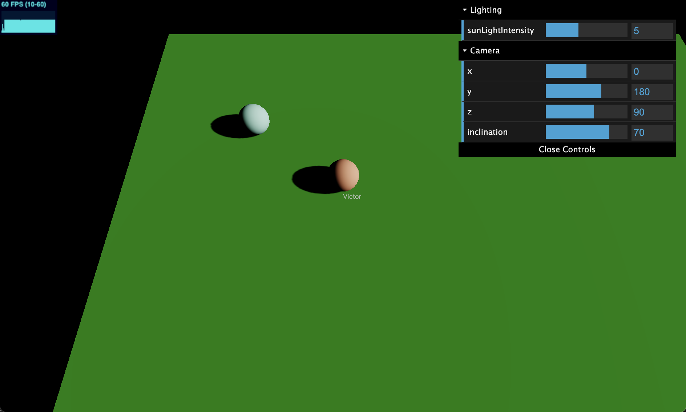

# Kubernetes Deployment

This is a Three.js "game" with a multiplayer backend using WebSockets ([socket.io](https://socket.io/)).



ARCHITECTURE DIAGRAM GOES HERE

## Requirements

- Oracle Cloud Infrastructure account
- OCI CLI installed and configured
- OCI Kubernetes Cluster
- `kubectl` configured
- OCI user with Auth Token
- Node.js

## TODO

Improvements:

- Scale number of backend
- WebWorker
- Create a stress test
- Water and boats with heading
- Waste Generator
- Winning logic
- Score board
- Analytics (data points, latency, etc)
- Add LogAnalytics
- Authentication?

## Set Up

### Kubernetes Cluster

Create a Kubernetes cluster through the OCI web console.

Follow [Creating a Kubernetes Cluster](https://docs.oracle.com/en-us/iaas/Content/ContEng/Tasks/contengcreatingclusterusingoke.htm).

Configure kubectl on Cloud Shell. Follow steps on Quick start on your Kubernetes Cluster.

### Clone repo

Clone this repository in your local machine:

```
git clone --branch k8s https://github.com/vmleon/oci-multiplayer.git
```

Change directory to the `oci-multiplayer`:

```
cd oci-multiplayer
```

## Build and Deployment

To complete the environment setup you need an Auth Token from OCI.

Export the variable `OCI_OCIR_TOKEN` for best practices. Otherwise the script will ask for the token.

> Keep the double quotes to escape the token

```bash
export OCI_OCIR_TOKEN="<your_auth_token>"
```

You can also export `OCI_OCIR_USER` to the user (email) to login to the OCI container registry.

```bash
export OCI_OCIR_USER=<your_email>
```

Set environment:
```bash
npx zx scripts/setenv.mjs
```

> This script will:
> - check dependencies
> - create self-signed certs, if needed
> - login to container registry
> - print components versions

Release the server:
```bash
npx zx scripts/release.mjs
```

Answer: `server`

Release the web:
```bash
npx zx scripts/release.mjs
```

Answer: `web`

Prepare deployment to Kubernetes:
```bash
npx zx scripts/deploy.mjs
```

Apply deployment:
```bash
kubectl apply -k deploy/k8s/overlays/prod
```

Get the Public IP of the load balancer
```bash
kubectl -n ingress-nginx get svc
```

## Develop

Change the code, and bump the version of the component:
```bash
npx zx scripts/bump.mjs
```

Answer `server` or `web`.

Run release script for the component to push the new image.
```bash
npx zx scripts/release.mjs
```

Update `deploy/k8s/overlays/prod/kustomization.yaml` to the new version for the component.

Redeploy with:
```bash
kubectl apply -k deploy/k8s/overlays/prod
```

## Clean Up

Destroy all the infrastructure:

```
kubectl delete -k deploy/k8s/overlays/prod
```

> TODO delete container images on OCI registry