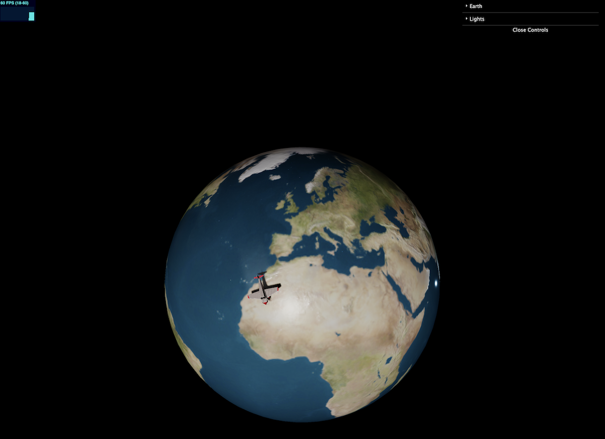

# OCI Multiplayer Game

This is a Three.js game with multiplayer feature.

## TO-DO

- Phase I
  - Three.js viz
  - Backend WebSocket
  - Players "see" each other
  - Create web server (terraform)
  - Provision web (ansible)
  - Create server (terraform)
  - Provision server (ansible)



## Build

Inside the `web` directory to generate a `dist` directory with the static web
```
npm run build
```

## Deployment

Inside the `deploy/terraform` directory

```
terraform init
terraform apply
```

Inside the `deploy/ansible` directory

```
ansible-playbook -i ../terraform/generated/app.ini web/web.yaml
```

> To destroy the infrastructure, inside `deploy/terraform`
> Run: `terraform destroy`