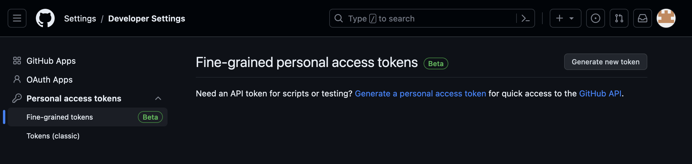

# Lab 1: GitHub Fork

## Introduction
During this lab, you are going to clone a GitHub repository to have your own copy. The rest of the workshop will be working based on your fork.

Estimated Lab Time: 15 minutes

### Prerequisites

* An Oracle Free Tier, Paid or LiveLabs Cloud Account
* Active Oracle Cloud Account with available credits to use for Data Science service.

## Task 1: Fork repo

1. Open a new tab in your browser and go to the [OCI DevOps OKE](https://github.com/vmleon/oci-multiplayer) repository.
  
  

1. Click on **Fork**.
  
  

3. Leave the repo name and click **Create fork**, it takes just a few seconds.
  
  
  
  
4. When the fork process has finished take a look to the URL. Now the repo is under your GitHub user.
  
  
  

## Task 2: Create an access token

1. Go to your profile icon in GitHub.
  
  

2. Go to **Settings**.
  
  

1. Scroll to the end, and click **Developer settings**.
  
  

1. Expand **Personal access tokens** and click on **Fine-grained tokens**.
  
  

1. Click **Generate new token**.
  
  

1. Fill in the form: **Token name**, **Expiration**, **Description**, **Resource owner**
  
  

1. Check **Only select repositories**.
  
  

8.  On permissions, set **Contents** to **Read-only**. (to be confirmed that this is enough)
  
  

9.  Click **Generate token**.
  
  

1.  It will ask for your GitHub Account password to confirm.
  
  

1.  Copy the generated token in a safe place. You will need it later. Make sure to copy your personal access token now as you will not be able to see this again.
  
  

## Task 3: Clone the new repository

1. Clone the forked repository. Click Code and select HTTPS.
    
  

1. Log in on Oracle Cloud and open Cloud Shell.
  
  

1. Git Clone the repository. Type `git clone ` and then paste the URL copied from GitHub.

  

    ```bash
    <copy>git clone https://github.com/YOUR_USER_HANDLER/oci-multiplayer.git</copy>
    ```

1. Change the directory to the cloned repository:
    
    ```bash
    <copy>cd oci-multiplayer</copy>
    ```

You may now [proceed to the next lab](#next).

## Acknowledgements

* **Author** - Victor Martin, Tech Product Strategy Director (EMEA)
* **Contributors** - Wojciech Pluta - DevRel, Eli Schilling - DevRel
* **Last Updated By/Date** - July 1st, 2023