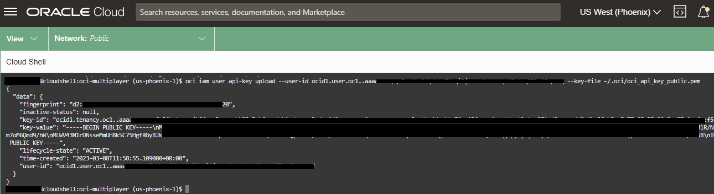
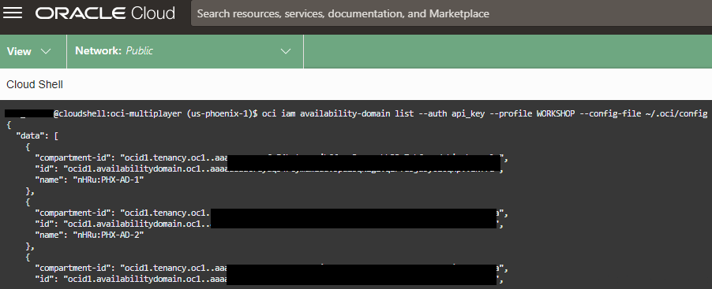

# Containerize and migrate to OCI Container Instances

## Introduction

In this lab we will create container images for the application components and deploy them to the Container Instances service. Container Instances is an excellent tool for running containerized applications, without the need to manage any underlying infrastructure. Just deploy and go.

To help streamline the process, you'll use a custom script to create and publish container images to the OCI Container Registry. Container Registry makes it easy to store, share, and managed container images. Registries can be private (default) or public.

Estimated Lab Time: 15 minutes

### Prerequisites

* An Oracle Free Tier or Paid Cloud Account

## Task 1: Configure alternate CLI Authentication

While the cloud shell is pre-configured to authenticate based on logged-on user credentials, it can be quite useful to understand how easy it is to leverage alternate authenticate methods. The following is also useful when leveraging the OCI CLI outside of Cloud Shell.

In this section we will configure the CLI to use APIKey-based authentication.

1. Retrieve your user OCID and store it in a temporary location.

    ```
    <copy>echo $OCI_CS_USER_OCID</copy>
    ```

2. Retrieve your tenancy OCID and store it in a temorary location.

    ```
    <copy>echo $OCI_TENANCY</copy>

3. Initiate CLI configuration.

    ```
    <copy>oci setup config</copy>
    ```

    

4. You will be prompted with a series of questions. When requested, enter your user OCID, your tenancy OCID, a profile name, and the name of the region you are using (a list will be presented for reference).

    

5. When asked whether to create a new `API Signing RSA key pair`, type 'Y' and press enter, then continue pressing enter to accept all defaults.

6. Now...we can utilize the built-in authentication in Cloud Shell to upload the public portion of the API signing key to our user profile.

    ```
    <copy>oci iam user api-key upload --user-id <paste user OCID> --key-file ~/.oci/oci_api_key_public.pem</copy>
    ```

    

7. Time to test it out!

    ```
    <copy>oci iam availability-domain list --auth api_key --profile WORKSHOP --config-file ~/.oci/config</copy>
    ```

    **_NOTE:_** The profile name you entered will automatically be converted to all CAPS. Make sure to do the same when you enter the CLI command.

8. You should see either 1 or 3 AZs depending on which region you are using.

    

## Task 2: Containerize the application

1. XXX

2. XXX

3. XXX

## Acknowledgements

* **Author** - Victor Martin - Technology Product Strategy Director - EMEA
* **Author** - Wojciech (Vojtech) Pluta - Developer Relations - Immersive Technology Lead
* **Last Updated By/Date** - March, 2023
