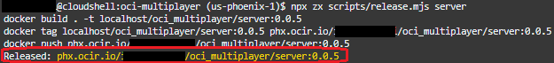
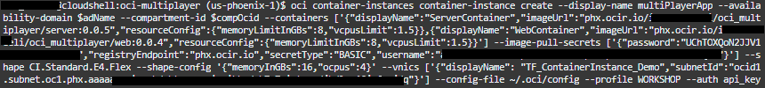
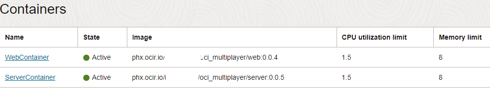
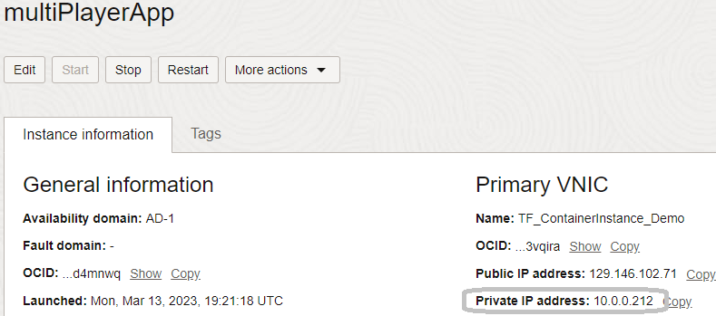
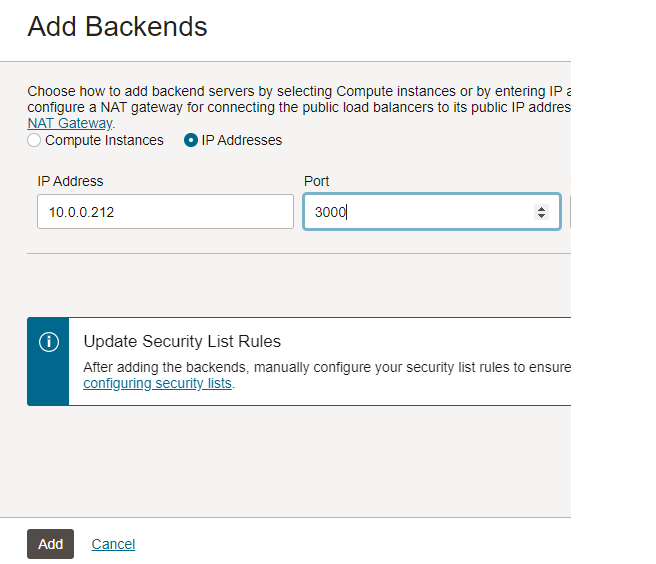

# Containerize and migrate to OCI Container Instances

## Introduction

In this lab we will create container images for the application components and deploy them to the Container Instances service. Container Instances is an excellent tool for running containerized applications, without the need to manage any underlying infrastructure. Just deploy and go.

To help streamline the process, you'll use a custom script to create and publish container images to the OCI Container Registry. Container Registry makes it easy to store, share, and managed container images. Registries can be private (default) or public.

**_Important_** The instructions in this lab are designed around the Cloud Shell and utilize some of the built-in session variables. Should you choose to complete this outside of cloud shell, you will need to locate those resource OCID's manually (Web UI or OCI CLI).

Estimated Lab Time: 15 minutes

### Prerequisites

* An Oracle Free Tier or Paid Cloud Account

## Task 1: Configure alternate CLI Authentication

While the cloud shell is pre-configured to authenticate based on logged-on user credentials, it can be quite useful to understand how easy it is to leverage alternate authenticate methods. The following is also useful when leveraging the OCI CLI outside of Cloud Shell.

In this section we will configure the CLI to use APIKey-based authentication.

1. Retrieve your user OCID and store it in a temporary location.

    ```
    <copy>echo $OCI_CS_USER_OCID</copy>
    ```

2. Retrieve your tenancy OCID and store it in a temporary location.

    ```
    <copy>echo $OCI_TENANCY</copy>

3. Initiate CLI configuration.

    ```
    <copy>oci setup config</copy>
    ```

    

4. You will be prompted with a series of questions. When requested, enter your user OCID, your tenancy OCID, a profile name, and the name of the region you are using (a list will be presented for reference).

    

5. When asked whether to create a new `API Signing RSA key pair`, type 'Y' and press enter, then continue pressing enter to accept all defaults.

6. Now...we can utilize the built-in authentication in Cloud Shell to upload the public portion of the API signing key to our user profile.

    ```
    <copy>oci iam user api-key upload --user-id <paste user OCID> --key-file ~/.oci/oci_api_key_public.pem</copy>
    ```

    

7. Time to test it out!

    ```
    <copy>oci iam availability-domain list --auth api_key --profile WORKSHOP --config-file ~/.oci/config</copy>
    ```

    **_NOTE:_** The profile name you entered will automatically be converted to all CAPS. Make sure to do the same when you enter the CLI command.

8. You should see either 1 or 3 AZs depending on which region you are using.

    

## Task 2: Containerize the application

In this task you will create a container image for both the server and the web pieces of the application. The container images will be stored in the OCI Container Registry for deployment to Container Instances (and eventually OKE).

1. Generate an Auth token for your cloud user; this is required to authenticate to OCI Container Registry.

    ```
    <copy>oci iam auth-token create --description "DevLive-Workshop" --user-id $OCI_CS_USER_OCID --query 'data.token' --raw-output</copy>
    ```

2. Copy the output string and store it in a safe place. Then create an environment variable as well.

    ```
    <copy> export OCI_OCIR_TOKEN="[auth-token-here]"</copy>
    ```

    _note:_ remove the square braces when pasting your auth token

3. Create an environment variable for your email address.

    ```
    <copy>export OCI_OCIR_USER=[OCI_email_or_IAM_user_id]</copy>
    ```

4. Make sure you're in the `oci-multiplayer` directory.

    ```
    <copy>cd ~/oci-multiplayer</copy>
    ```

5. Run the script to set the environment. This script will

    * check dependencies

    * create self-signed certificates, if needed

    * log into the container registry to validate credentials

    * print component versions

    ```
    <copy>npx zx scripts/setenv.mjs</copy>
    ```

6. Create and publish the **`server`** container image.

    ```
    <copy>npx zx scripts/release.mjs server</copy>
    ```

7. Copy the `Released:` path at the end of the command execution and store it in a text document.

    

8. Create and publish the **`web`** container image.

    ```
    <copy>npx zx scripts/release.mjs web</copy>
    ```

9. Copy the `Released:` path for this one as well; store it in a text documnt.


## Task 3: Deploy to Container Instances ##
Now to grab just a few more pieces of information and launch the Container Instances resource.

1. You may either navigate the OCI console to locate the OCID of your subnet, or run the following CLI command. Copy the Subnet OCID to a text file.

    ```
    <copy>oci network subnet list -c $OCI_TENANCY --display-name "multiplayer public subnet" --query 'data[0].id' --raw-output</copy>
    ```

    _note:_ if you are not using the root compartment, replace `$OCI_TENANCY` with the OCID of your chosen compartment.

2. Retrieve the Availability Domain label and copy to a text file.

    ```
    <copy>oci iam availability-domain list --query 'data[?contains ("name",`AD-1`)]|[0].name' --raw-output</copy>
    ```

3. Finally - you'll need to convert your OCIR username and auth token / password to _base64_ as requirec by the CLI.

    ```
    <copy>
    echo -n '<tenancy name>/<username>' | base64
    echo -n '<auth token>' | base64
    </copy>
    ```

4. Copy the following command to a text file, modify the <placeholder> values, then paste into Cloud Shell.

    ```
    <copy>oci container-instances container-instance create --display-name oci-MultiPlayer --availability-domain <AD Name> --compartment-id <Compartment OCID> --containers ['{"displayName":"ServerContainer","imageUrl":"<release path for server image>","resourceConfig":{"memoryLimitInGBs":8,"vcpusLimit":1.5}},{"displayName":"WebContainer","imageUrl":"<release path for Web image>","resourceConfig":{"memoryLimitInGBs":8,"vcpusLimit":1.5}}'] --shape CI.Standard.E4.Flex --shape-config '{"memoryInGBs":16,"ocpus":4}' --vnics ['{"displayName": "ocimultiplayer","subnetId":"<subnet OCID>"}'] --image-pull-secrets ['{"password":"<base-64-encoded-auth-token>","registryEndpoint":"<OCIR endpoint>","secretType":"BASIC","username":"<base-64-encoded-username>"}'] --config-file ~/.oci/config --profile WORKSHOP --auth api_key</copy>
    ```

    _The command will look something like this (notice we created variables for a few of the parameter values - totally optional):_

    

5. In the Web UI, you can navigate to **`Developer Services`** -> `Container Instances` to watch the progress of the deployment. Observe when the two containers move to an Active state.

    

6. Locate the private IP address for your container instance.

    

## Task 4: Modify the Load Balancer
In this 4th and final task, you will add the Container Instance private IP address to the backend set of the load balancer that was deployed as part of the first lab. Optionally (but ideally), you may also remove the compute resources.

1. Navigate to **`Networking`** -> `Load Balancers` and select the _LB Multiplayer_ resource.

2. Scroll down to the _Backend Sets (2)_ link in the lefthand nagivation menu; click it.

3. Click the back-end named `lb-backend-set-web`, click _Backends_, then click `[Add Backends]`. Select the _Private IP_ radio button, paste the private IP of the Container Instance, and enter port 80. Click `[Add]`.

4. Repeat the above for the `lb-backend-set-server` resource, this time using port 3000 instead of port 80.

    

5. **_[OPTIONAL]_** Select and delete the pre-existing IP address from each of the `Backend Set` items.

6. Copy the public IP address of your load balancer and paste it into a new browser tab / window. Confirm the game is still functional.


## Acknowledgements

* **Author** - Victor Martin - Technology Product Strategy Director - EMEA
* **Author** - Wojciech (Vojtech) Pluta - Developer Relations - Immersive Technology Lead
* **Author** - Eli Schilling - Developer Advocate - Cloud Native and DevOps
* **Last Updated By/Date** - March, 2023
