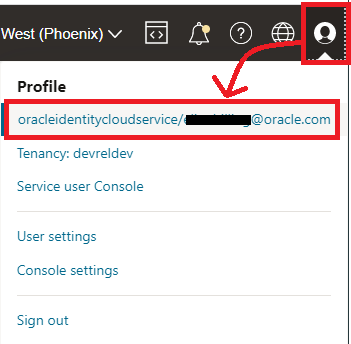

# Enhance the application architecture

## Introduction
In this lab we will enhance our application in an effort to continue moving towards a more cloud native design. For this, an autonomous database will be deployed, new application components will be added, and the the entire solution wll be deployed to Oracle Container Engine for Kubernetes (OKE).


Estimated Lab Time: 15 minutes

## Task 1: Create OKE Cluster with Virtual Nodes

1. Minimize Cloud Shell and navigate to **`Developer Services`** -> **`Kubernetes Cluster (OKE)`**.

  

2. Click **Create cluster**, select [Quick create], then click **Submit**.

  

3. Provide a name for the cluster, under _Node Type_ choose **Virtual**, leaving all other settings as default.

  

4. Click **Next**, review the details of your cluster, and click **Create cluster**.

  

5. It will take just a couple of minutes to create the requisite resources. You can proceed to the next task while this is happening.

  

## Task 2: Create Autonomous Database (ATP)

1. Navigate to **`Oracle Databases`** -> **`Autonomous Transaction Processing`**.

  

2. Click **Create Autonomous Database**

  

3. Provide a display name and database name; these can be the same value.

  

4. Scroll down and provide a database password for the Admin user.

  

5. Click **Create Autonomous Database**.

  

6. It will take about a minute to create the DB. You may proceed to the next task.

  

## Task 3: Create and deploy the application

1. Navigate to **`Developer Services`** -> **`Kubernetes Cluster (OKE)`**.

  

2. Wait until the cluster is `Active`.

  

3. Click on the cluster link to access your brand-new Kubernetes Cluster.

  

4. Click **Access Cluster** then copy the command found under item 2 displayed on the screen.

    

5. Return to cloud shell, paste the above command, and execute. This will enable you to communicate with the OKE API endpoint for your cluster.

6. Ensure you are in the App directory.

    ```
    <copy>cd ~/devlive-save-the-wildlife</copy>
    ```

7. Assign environment variables to be consumed by the setup and deployment scripts. _(note: if you do not set these, the scripts will prompt you for the corresponding values upon execution)_

    ```
    <copy>
    export OCI_OCIR_TOKEN="<your auth token>"
    export OCI_OCIR_USER="<your userame>"
    export ADB_COMPARTMENT_NAME="<compartment name>"
    export ADB_NAME="<db name>"
    export ADB_PASSWORD="<db admin password>"
    </copy>
    ```

    **note:** *Your full username can be obtained by clicking the User icon in the top right corner of the screen. Federated users will be different from IAM users.*

    

8. Setup the environment.

    ```
    <copy>npx zx scripts/setenv.mjs</copy>
    ```

    This script will:
        * check dependencies
        * create self-signed certs, if needed
        * login to container registry
        * print components versions

9. Release all application components.

    ```
    <copy>npx zx scripts/release.mjs -a</copy>
    ```

10. Update the deployment manifest with latest versions.

    ```
    <copy>npx zx scripts/deploy.mjs</copy>
    ```

11. Deploy all application components to OKE.

    ```
    <copy>kubectl apply -k deploy/k8s/overlays/prod</copy>
    ```

12. Verify the pods were deployed (it might take a minute or so for all pods to come online).

    ```
    <copy>kubectl get pods</copy>
    ```

    

13. Obtain the external service IP for the application you just deployed.

    ```
    <copy>kubectl -n ingress-nginx get svc</copy>
    ```

    

14. Paste the IP address from step 12 in a new browser tab and check it out!

15. **[OPTIONAL]** To delete the service and all K8s pods:

    ```
    <copy>kubectl delete -k deploy/k8s/overlays/prod</copy>
    ```

    You may then proceed to delete the Autonomous Database, the OKE cluster, and its Virtual Cloud Network, in that ordern.


## Acknowledgements

* **Author** - Victor Martin - Technology Product Strategy Director - EMEA
* **Author** - Wojciech (Vojtech) Pluta - Developer Relations - Immersive Technology Lead
* **Author** - Eli Schilling - Developer Advocate - Cloud Native and DevOps
* **Last Updated By/Date** - May, 2023
