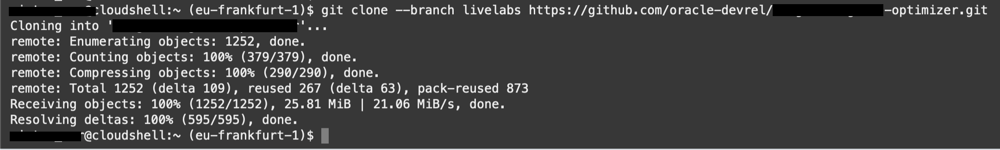

# Initial App Deployment - Virtual Machines

## Introduction

In this lab you will complete the process of deploying the first form of the Three.js app to the Oracle Cloud. The deployment process utilizes Terraform and Ansible, however, we've provided a script to help streamline the process.

Terraform is an Open Source tool to deploy resources in the cloud using code. This method is typically referred to as Infrastructure as Code (IaC). Terraform configuration is declarative; you simply define what you want in the Oracle Cloud and it ensures the resources are created to your speciications.

Ansible is na open source tool that provides both configuration management and infrastructure as code. For this workshop, we leverage the configuration management functionality. Once Terraform deploys the infrastructure, Ansible will establish a remote SSH connection to the servers and apply the requisite confniguration (app install, file downloads, configuration settings, etc.)

Estimated Lab Time: 15 minutes

### Prerequisites

* An Oracle Free Tier or Paid Cloud Account


## Task 1: Cloud Shell

1. From the Oracle Cloud Console, click on **Cloud Shell**

    

2. As soon as the Cloud Shell is loaded, you can retrieve the workshop assets for this lab.

    ```
    <copy>git clone https://github.com/vmleon/oci-multiplayer</copy>
    ```

3. The result will look like this:

    

4. Change directory with `cd` to `oci-multiplayer` directory:

    ```
    <copy>cd oci-multiplayer</copy>
    ```

5. Terraform uses a file called `tfvars` that contains variables used to communicate with the Oracle Cloud. You are going to copy the provided template file and input your own values. The the following command:

    ```
    <copy>cp deploy/vm/terraform/terraform.tfvars.template deploy/vm/terraform/terraform.tfvars</copy>
    ```

6. And finally, you will need to create an SSH key pair. It will primarily be used by Ansible to apply configuration to your Compute instances, but you can also use it if you want to log into either of the servers.

    ```
    <copy>ssh-keygen -b 2048 -t rsa</copy>
    ```

    Accepting the defaults will create a private key `id_rsa` and public key `id_rsa.pub` in a _.ssh_ folder under the home directory.

## Task 2: Configure Terraform

1. Click on **Code Editor** - which can be found next to Cloud Shell.

    

2. Within the Explorer section of the code editor, exand your username and navigate to _`deploy/vm/terraform`_. You should see the file **`terraform.tfvars`** - select that.

    

3. The file will open and you can copy the values obtained from running the next several commands. You can copy from Cloud Shell and pasted into Code Editor.

4. Copy the output of the following command as the tenancy OCID:
    ```
    <copy>echo $OCI_TENANCY</copy>
    ```

    

5. Copy the output of the same command as the compartment OCID:
    ```
    <copy>echo $OCI_TENANCY</copy>
    ```
    
    > Note: we can paste the same OCID here in both tenancy and compartment because the root compartment in a tenancy is equal to the tenancy's OCID.

    

    > You can deploy the infrastructure **within a specific compartment**<br>
    > You can get the Compartment OCID in different ways.<br>
    > The coolest one is with OCI CLI from the Cloud Shell.<br>
    > You have to change _`COMPARTMENT_NAME`_ for the actual compartment name you are looking for and run the command:
    > ```
    > <copy>oci iam compartment list --all --compartment-id-in-subtree true --query "data[].id" --name COMPARTMENT_NAME</copy>
    > ```

6. And finally, retrieve the contents of your public SSH key and add to the file.

    ```
    <copy>cat ~/.ssh/id_rsa.pub
    ```

    
    
6. Save the file in the Code Editor.

    

## Task 3: Initiate Deployment

1. Run the deployment script which is stored in the _`scripts`_ folder.


    ```
    <copy>./scripts/start_VM.sh</copy>
    ```

2. The script will begin by building the web server packages:

    

3. Once that finishes, it will move on to the Terraform deployment:

    

4. Note that once the Terraform deployment is complete, it will print the public IP addresses of the two servers and the load balancer that were created. No need to capture these now, we'll print them on the screen at the end.

    

5. And there you have it! Copy the _`lb_public_ip`_ value, open a new browser tab, and check it out.

    


## Acknowledgements

* **Author** - Victor Martin - Technology Product Strategy Director - EMEA
* **Author** - Wojciech (Vojtech) Pluta - Developer Relations - Immersive Technology Lead
* **Author** - Eli Schilling - Developer Advocate - Cloud Native and DevOps
* **Last Updated By/Date** - March, 2023
